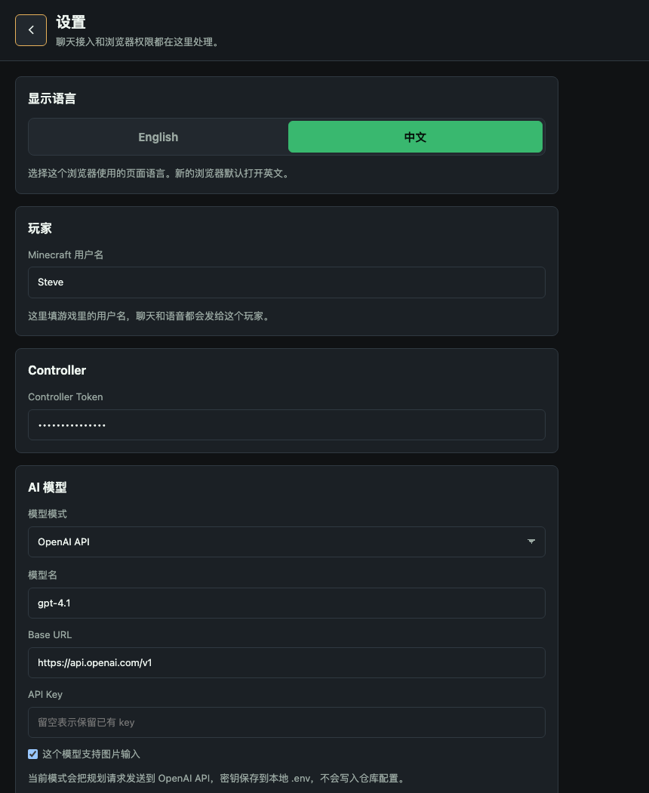
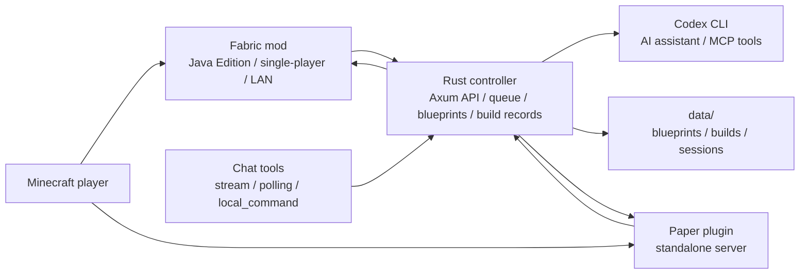

# Blockwright

<p align="center">
  
</p>

English | [简体中文](README.zh-CN.md)

Website source: [docs/index.html](docs/index.html). GitHub Pages setup notes: [docs/GITHUB_PAGES.md](docs/GITHUB_PAGES.md).

Blockwright lets you control Minecraft with natural language: build, run commands, give items, inspect the world, and change gameplay as you play.

Blockwright is an AI building and game-control assistant for Minecraft Java Edition. Players type `/bw ...` in game; the controller handles model calls, blueprints, task queues, and build records, while Fabric/Paper execution plugins read and modify the Minecraft world.

The project currently targets Minecraft Java Edition worlds through Fabric and Paper. Fabric is the primary path for local single-player and LAN-opened worlds; Paper is kept for standalone server deployments.



## ✨ Core Features

- 🎮 Send natural-language requests in game with `/bw ...`: give items, change weather/time, build houses, or edit existing structures.
- 🧠 Choose Codex CLI, OpenAI, DeepSeek, Doubao, or Gemini from the `/web` settings page.
- 🧱 Generate a blueprint and build record before sending the exact block list to Minecraft.
- ✅ Verify each placed block from the Fabric/Paper execution side before marking a build successful.
- 🔍 Scan nearby world blocks and match saved build records before editing existing builds.
- 🧩 Preserve block states in materials, such as `minecraft:oak_leaves[persistent=true]` and `minecraft:oak_door[half=lower,facing=south]`.
- 🤖 Use the controller as the single entrypoint for external chat tools before tasks are sent to Minecraft.

## 🧭 Project Status

Blockwright is an early but runnable project. It already includes the Rust controller, Fabric mod, Paper plugin, MCP tools, blueprint persistence, task queue, execution verification, and Codex CLI planning loop.

Good current use cases:

- Local build automation experiments in Minecraft Java Edition worlds.
- Developer testing of the controller, Minecraft execution plugins, and blueprint model.
- Iterative work on chat integrations, image-to-blueprint, and existing-build edits.

Not recommended yet:

- Exposing the controller directly to the public internet without additional authentication.
- Large public servers with unrestricted automatic building.
- Committing real chat tool tokens, webhooks, client secrets, or other credentials.

## 🌐 Website and GitHub Pages

The repository now includes a static project website. It defaults to English and includes an English/Chinese language switch:

```text
docs/index.html
```

Recommended GitHub Pages settings:

```text
Source: Deploy from a branch
Branch: main
Folder: /docs
```

After GitHub publishes the site, put the generated Pages URL in the repository About Website field. Use [docs/assets/social-preview.png](docs/assets/social-preview.png) as the repository social preview image. See [docs/GITHUB_PAGES.md](docs/GITHUB_PAGES.md) for the full setup checklist.

## 🧱 Architecture



Component boundaries:

- `apps/controller`: Rust/Axum controller for HTTP APIs, chat entrypoints, Codex CLI integration, blueprints, task queue, and build records.
- `plugins/fabric`: Primary execution plugin for Java Edition, single-player, and LAN-opened worlds.
- `plugins/paper`: Execution plugin for standalone Paper servers.
- `blueprints/examples`: Committable blueprint examples.
- `config/servers`: Example server configuration.
- `config/chat.example.yaml`: Example chat tool configuration.
- `docs`: Architecture, roadmap, MCP, and user installation docs.

See [docs/ARCHITECTURE.md](docs/ARCHITECTURE.md) for the detailed design.

## 🚀 Quick Start

### 📦 Requirements

For players/local use:

- Minecraft Java Edition `1.21.8`.
- Fabric Loader.
- Fabric API.
- Blockwright Fabric mod jar.
- Logged-in Codex CLI, or an OpenAI / DeepSeek / Doubao / Gemini API key configured from `/web` settings.

For development builds:

- Rust stable.
- JDK 21.
- Gradle.
- Optional: `cargo-llvm-cov` for local coverage checks.

### 🖥️ Start the Web UI

If executable bits are lost after copying the project from an archive or chat app, restore them once:

```bash
chmod +x scripts/*.sh
```

Start the controller and `/web` UI:

```bash
./scripts/run-web.sh
```

You can also use Make:

```bash
make run-web
```

### 🤖 AI Model Provider

Codex CLI is the default planning mode. In `/web` settings, open **AI model** and choose one of:

- `Codex CLI`: uses the controller's configured `codex` command.
- `OpenAI API`: stores model/Base URL in `config/llm.local.yaml` and stores `OPENAI_API_KEY` in local `.env`.
- `DeepSeek API`: stores model/Base URL in `config/llm.local.yaml` and stores `DEEPSEEK_API_KEY` in local `.env`.
- `Doubao API`: stores model/Base URL in `config/llm.local.yaml` and stores `ARK_API_KEY` in local `.env`.
- `Gemini API`: stores model/Base URL in `config/llm.local.yaml` and stores `GEMINI_API_KEY` in local `.env`.

Switching providers only swaps the planning/translation backend. Blueprint planning, scan context, build records, queueing, progress updates, and the Web flow still run through the same controller path. API modes keep short context per player/username so follow-ups such as "continue" or "change that" still have continuity. Image input requires a vision-capable model; OpenAI, Doubao, and Gemini enable image input by default, while DeepSeek is text-only by default and image requests fall back to Codex CLI instead of silently dropping the image.

`config/llm.local.yaml` and `.env` are ignored by Git. Use `config/llm.example.yaml` as the committed template.

Use another port temporarily:

```bash
PORT=18765 ./scripts/run-web.sh
```

The web UI has a globe button in the top-right corner for switching between English and Chinese. The preference is stored in the browser only and does not change API, blueprint, or build-record formats.

Local health check:

```bash
curl http://127.0.0.1:8765/health
```

By default the script prints local and LAN HTTP/HTTPS addresses. Phone voice input needs HTTPS because mobile browsers usually require a secure context for microphone access. The controller can generate a local root certificate and server certificate; install and trust the root certificate from the `/web` settings page before using mobile voice.

### 🧩 Install the Java Edition / Fabric Mod

Fabric is the default installation path for Java Edition, single-player, and LAN-opened worlds.
The target game instance must also have Fabric API installed.

```bash
make
```

This builds the Rust controller first, packages the current platform's controller binary into the Fabric mod jar, detects the current Minecraft `--gameDir` when possible, removes old `blockwright-fabric-*.jar` files from `mods/`, and installs the new single jar. If Java Edition is not running, it tries `/Applications/.minecraft` first, then `~/.minecraft`.

Specify a game directory manually:

```bash
make GAME_DIR=<current Java Edition game directory>
```

On later game starts, the Fabric mod checks `http://127.0.0.1:8765/health`. If the controller is not already running, the mod extracts the packaged controller from the jar, starts the web service, and prints the Web URL in the Minecraft startup log/terminal. A separate terminal for `./scripts/run-web.sh` is no longer required.

For public distribution, build a multi-platform controller bundle and package it into one universal jar:

```bash
./scripts/build-java-mod.sh --all-platforms
```

The universal jar can carry `macos-aarch64`, `macos-x86_64`, `linux-aarch64`, `linux-x86_64`, and `windows-x86_64` controllers. The mod selects the matching controller at game startup. Multi-platform builds require the matching Rust targets and linkers locally or in CI. If prebuilt binaries are already available, arrange them as `target/blockwright-controller-bundle/<platform>/blockwright-controller(.exe)` and run:

```bash
./scripts/build-java-mod.sh --controller-bundle-dir target/blockwright-controller-bundle
```

The repository also includes a manual GitHub Actions workflow named `Universal Fabric Mod`: each platform runner builds its native controller, then a final job merges the binaries and uploads a `blockwright-fabric-universal` artifact.

See [docs/user/JAVA_FABRIC_INSTALL.md](docs/user/JAVA_FABRIC_INSTALL.md) for the full installation guide.

### 🎮 In-Game Commands

Common examples:

```text
/bw give me a diamond sword
/bw build me a wooden cabin
/bw replace the windows of this house with blue glass
```

Command reference:

| Command | Purpose |
| --- | --- |
| `/bw <request>` | Let AI handle items, weather, time, buildings, edits, and ordinary game operations. |
| `/bw ask <request>` / `/bw chat <request>` | Explicitly send a chat/planning request. |
| `/bw web` | Print local and LAN web addresses in Minecraft chat. |
| `/bw config` | Point users to the Web settings page. |
| `/bw reload` | Reload local Fabric configuration. |
| `/bw restart` / `/bw controller restart` | Restart the controller service after Web/API/model config changes. |
| `/bw logs` | Show recent model-related controller logs. |
| `/bw logs watch` | Stream model-related logs into Minecraft chat; run again to stop. |
| `/bw logs all` / `/bw logs watch all` | Show or stream raw controller logs. |
| `/bw url` / `/bw address` / `/bw lan` | Address aliases for `/bw web`. |

Settings live in the controller web UI. Open `/web`, use the top-right settings panel, and save model or chat-tool integrations there. `/bw config` only points users to that page.

`/bw restart` restarts the controller service only. New or changed Fabric Java commands still require restarting Minecraft so the game can load the new jar.

### 🧯 Troubleshooting and Logs

- If in-game requests feel slow, run `/bw logs` and check scan size, model provider, and elapsed time.
- To watch a request live, run `/bw logs watch`, then send a `/bw ...` request.
- From a local terminal, the full log is available with `tail -n 200 -f /Applications/.minecraft/logs/blockwright-controller.log`.
- After changing `/web` or controller code, use `/bw restart`; after changing Fabric mod commands, restart Minecraft.

## 🧪 API Examples

Simulate an in-game command:

```bash
curl -X POST http://127.0.0.1:8765/api/minecraft/message \
  -H 'Content-Type: application/json' \
  -d '{"server_id":"local-java","player":"Steve","text":"give me a diamond sword","position":{"world":"world","x":0,"y":64,"z":0}}'
```

Simulate an external robot message:

```bash
curl -X POST http://127.0.0.1:8765/api/robot/message \
  -H 'Content-Type: application/json' \
  -d '{"platform":"telegram","conversation_id":"local","sender":"charles","server_id":"local-java","target_player":"Steve","text":"build me a wooden cabin"}'
```

If the API returns `job_id`, Minecraft execution is required. Query the build record:

```bash
curl http://127.0.0.1:8765/api/builds/<job_id>
```

## 👩‍💻 Development

Common commands:

```bash
make test              # controller + Paper + Fabric tests
make test-controller   # Rust controller tests
make test-fabric       # Fabric mod tests
make test-paper        # Paper plugin tests
make build-fabric      # build Fabric mod
make build-paper       # build Paper plugin
make build-plugins     # build Fabric + Paper
make coverage          # controller coverage gate
```

Recommended pre-commit checks:

```bash
cargo test --workspace
cd plugins/fabric && gradle test
cd plugins/paper && gradle test
```

Contributor resources:

- [CONTRIBUTING.md](CONTRIBUTING.md)
- [CODE_OF_CONDUCT.md](CODE_OF_CONDUCT.md)
- [SUPPORT.md](SUPPORT.md)
- [SECURITY.md](SECURITY.md)
- [CHANGELOG.md](CHANGELOG.md)

## 📄 License

Blockwright is licensed under the [MIT License](LICENSE).
