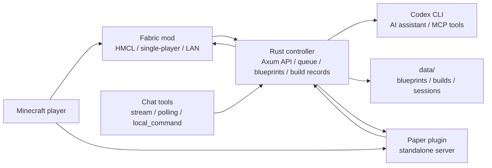

# Blockwright

English | [简体中文](README.md)

Blockwright is a local-first Minecraft AI assistant. It keeps chat adapters, MCP tools, blueprint management, task queues, and build records in an external controller, while Fabric and Paper plugins read and modify the Minecraft world through server APIs.

The project is currently optimized for HMCL, Fabric single-player worlds, and LAN-opened worlds. The Paper plugin is kept for standalone Paper server deployments.

## Core Features

- Send requests in game with `/bw ...`, such as giving items, changing time, building a cabin, or editing an existing structure.
- Use the controller as the single entrypoint for external chat tools before tasks are sent to Minecraft.
- Let the controller run Codex CLI as an AI assistant with Blockwright MCP tools for player state, inventory, nearby blocks, blueprints, and build records.
- Store blueprint block coordinates as relative coordinates, then apply the player or task origin only during execution.
- Save a build record before sending the exact block list to Minecraft.
- Verify each placed block from the Fabric/Paper execution side before marking a build successful.
- Preserve block states in materials, such as `minecraft:oak_leaves[persistent=true]` and `minecraft:oak_door[half=lower,facing=south]`.
- Scan nearby world blocks and match saved build records before editing existing builds.

## Project Status

Blockwright is an early but runnable project. It already includes the Rust controller, Fabric mod, Paper plugin, MCP tools, blueprint persistence, task queue, execution verification, and Codex CLI planning loop.

Good current use cases:

- Local AI building experiments in HMCL/Fabric worlds.
- Developer testing of the controller, Minecraft execution plugins, and blueprint model.
- Iterative work on chat integrations, image-to-blueprint, and existing-build edits.

Not recommended yet:

- Exposing the controller directly to the public internet without additional authentication.
- Large public servers with unrestricted automatic building.
- Committing real chat tool tokens, webhooks, client secrets, or other credentials.

## Architecture



Component boundaries:

- `apps/controller`: Rust/Axum controller for HTTP APIs, chat entrypoints, Codex CLI integration, blueprints, task queue, and build records.
- `plugins/fabric`: Primary execution plugin for HMCL, single-player, and LAN-opened worlds.
- `plugins/paper`: Execution plugin for standalone Paper servers.
- `blueprints/examples`: Committable blueprint examples.
- `config/servers`: Example server configuration.
- `config/chat.example.yaml`: Example chat tool configuration.
- `docs`: Architecture, roadmap, MCP, and user installation docs.

See [docs/ARCHITECTURE.md](docs/ARCHITECTURE.md) for the detailed design.

## Quick Start

### Requirements

- Rust stable.
- JDK 21.
- Gradle.
- Minecraft 1.21.8 + Fabric Loader.
- Fabric API.
- Optional: `cargo-llvm-cov` for local coverage checks.
- Logged-in Codex CLI. The controller no longer falls back to local keyword rules for building or action intent.

### Start the Web UI

If executable bits are lost after copying the project from an archive or chat app, restore them once:

```bash
chmod +x scripts/*.sh
```

Start the controller and `/web` UI:

```bash
./scripts/run-web.sh
```

You can also use Make:

```bash
make run-web
```

Use another port temporarily:

```bash
PORT=18765 ./scripts/run-web.sh
```

The web UI has a globe button in the top-right corner for switching between English and Chinese. The preference is stored in the browser only and does not change API, blueprint, or build-record formats.

Local health check:

```bash
curl http://127.0.0.1:8765/health
```

By default the script prints local and LAN HTTP/HTTPS addresses. Phone voice input needs HTTPS because mobile browsers usually require a secure context for microphone access. The controller can generate a local root certificate and server certificate; install and trust the root certificate from the `/web` settings page before using mobile voice.

### Install the HMCL / Fabric Mod

Fabric is the default installation path for HMCL, single-player, and LAN-opened worlds.

```bash
make
```

This builds the Fabric mod, detects the current Minecraft `--gameDir` when possible, removes old `blockwright-fabric-*.jar` files from `mods/`, and installs the new jar. If HMCL is not running, it tries `/Applications/.minecraft` first, then `~/.minecraft`.

Specify a game directory manually:

```bash
make HMCL_DIR=<current HMCL game directory>
```

See [docs/user/HMCL_FABRIC_INSTALL.md](docs/user/HMCL_FABRIC_INSTALL.md) for the full installation guide.

### In-Game Usage

```text
/bw give me a diamond sword
/bw build me a wooden cabin
/bw replace the windows of this house with blue glass
/bw reload
/bw config
```

Settings live in the controller web UI. `/bw config` only points users to the web settings page.

## API Examples

Simulate an in-game command:

```bash
curl -X POST http://127.0.0.1:8765/api/minecraft/message \
  -H 'Content-Type: application/json' \
  -d '{"server_id":"hmcl-lan","player":"Steve","text":"give me a diamond sword","position":{"world":"world","x":0,"y":64,"z":0}}'
```

Simulate an external robot message:

```bash
curl -X POST http://127.0.0.1:8765/api/robot/message \
  -H 'Content-Type: application/json' \
  -d '{"platform":"telegram","conversation_id":"local","sender":"charles","server_id":"hmcl-lan","target_player":"Steve","text":"build me a wooden cabin"}'
```

If the API returns `job_id`, Minecraft execution is required. Query the build record:

```bash
curl http://127.0.0.1:8765/api/builds/<job_id>
```

## Development

Common commands:

```bash
make test              # controller + Paper + Fabric tests
make test-controller   # Rust controller tests
make test-fabric       # Fabric mod tests
make test-paper        # Paper plugin tests
make build-fabric      # build Fabric mod
make build-paper       # build Paper plugin
make build-plugins     # build Fabric + Paper
make coverage          # controller coverage gate
```

Recommended pre-commit checks:

```bash
cargo test --workspace
cd plugins/fabric && gradle test
cd plugins/paper && gradle test
```

Contributor resources:

- [CONTRIBUTING.md](CONTRIBUTING.md)
- [CODE_OF_CONDUCT.md](CODE_OF_CONDUCT.md)
- [SUPPORT.md](SUPPORT.md)
- [SECURITY.md](SECURITY.md)
- [CHANGELOG.md](CHANGELOG.md)

## License

Blockwright is licensed under the [MIT License](LICENSE).
