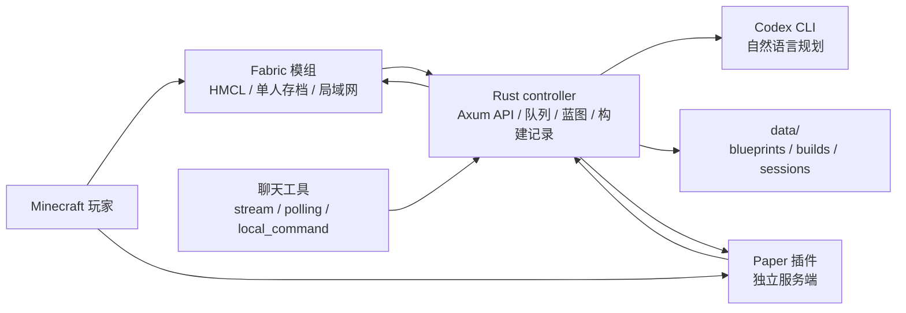

# Blockwright

Blockwright 是一个本地优先的 Minecraft 智能建造助手。它把自然语言、蓝图规划、任务队列和构建记录放在外部 controller，把真正修改世界的动作留在 Fabric/Paper 执行端。

项目当前面向 HMCL、Fabric 单人存档和局域网开放世界优先设计。Paper 插件保留给独立服务端场景。

## 核心能力

- 游戏内通过 `/bw ...` 发送需求，例如发物品、调时间、建造木屋或改造已有建筑。
- 外部机器人通过 controller 统一接入，再把任务下发到 Minecraft 世界。
- controller 先调用本地 Codex CLI 做意图分类，再把需求规划成结构化动作或蓝图 JSON。
- 蓝图使用相对坐标，真正放置时再叠加玩家位置或任务原点。
- 建筑任务先保存构建记录，再下发同一份方块清单到执行端。
- Fabric/Paper 执行端逐块读取世界状态生成校验报告，报告和构建记录一致才算成功。
- 支持携带方块状态的材质，例如 `minecraft:oak_leaves[persistent=true]`、`minecraft:oak_door[half=lower,facing=south]`。
- 改造已有建筑时先扫描玩家附近世界方块，再匹配已保存的构建记录；目标不明确时追问，不直接破坏世界。

## 项目状态

Blockwright 处于早期可运行阶段，已经具备本地 controller、Fabric 模组、Paper 插件、蓝图保存、任务队列、执行校验和 Codex CLI 规划闭环。

适合当前阶段的用途：

- 本地 HMCL/Fabric 世界里的智能建造实验。
- 开发者验证 controller、Minecraft 执行端和蓝图模型的协作方式。
- 逐步扩展聊天工具、图片转蓝图和已有建筑改造能力。

暂不建议当前阶段的用途：

- 直接暴露到公网且无需额外鉴权的生产服务。
- 大规模公共服务器自动建造。
- 把真实聊天工具 token、webhook 或 client secret 提交到仓库。

## 架构



组件边界：

- `apps/controller`：Rust/Axum 本地控制器，负责 HTTP API、聊天入口、Codex CLI 适配、蓝图管理、任务队列和构建记录。
- `plugins/fabric`：HMCL/单人存档/局域网开放世界的主执行端，负责游戏内命令、世界扫描、发物品、放方块和校验。
- `plugins/paper`：独立 Paper 服务端执行端，职责与 Fabric 类似，但面向服务端部署。
- `blueprints/examples`：可提交的蓝图示例。
- `config/servers`：随二进制打包的服务配置示例。
- `config/chat.example.yaml`：聊天工具本地配置示例。
- `docs`：架构、路线图和用户安装文档。

更完整的设计说明见 [docs/ARCHITECTURE.md](docs/ARCHITECTURE.md)。

## 快速开始

### 环境要求

- Rust stable。
- JDK 21。
- Gradle。
- Minecraft 1.21.8 + Fabric Loader。
- Fabric API。
- 可选：`cargo-llvm-cov`，用于本地覆盖率门禁。
- 已登录的 Codex CLI。controller 不再用本地关键词规则兜底识别建筑或动作意图。

### 启动 controller

```bash
cp .env.example .env
cargo run -p blockwright-controller
```

默认监听：

```text
http://127.0.0.1:8765
```

健康检查：

```bash
curl http://127.0.0.1:8765/health
```

默认配置位于 [config/servers/local.yaml](config/servers/local.yaml)。本地开发默认 `require_token: false`，如果要把 controller 暴露给其他机器，必须启用共享 token 或放在受控网络里。

### 安装 HMCL / Fabric 模组

项目默认把 Fabric 作为 HMCL、单人存档和局域网开放世界的主安装方式。

```bash
make
```

这个命令会构建 Fabric 模组并安装到默认 `~/.minecraft/mods`。如果 HMCL 使用了自定义游戏目录：

```bash
make HMCL_DIR=<HMCL当前游戏目录>
```

然后启动 controller，进入原来的单人存档，正常“开放到局域网”。房主机器安装 Blockwright 模组并运行 controller 即可；加入局域网的其他玩家不需要单独安装 Blockwright，前提是当前只使用原版方块、物品和服务端命令能力。

详细安装步骤见 [docs/user/HMCL_FABRIC_INSTALL.md](docs/user/HMCL_FABRIC_INSTALL.md)。

### 游戏内使用

```text
/bw 给我一把钻石剑
/bw 帮我盖一个木屋
/bw 把我面前这个房子的窗户换成蓝色玻璃
/bw reload
```

第一次调用 Codex CLI 或本地模型规划建筑时可能耗时较长。本地 controller 的 Codex 超时和 Fabric/Paper 请求超时默认都是 1800 秒，也就是最多等 30 分钟；新版 Fabric 模组会在加载时把旧的短超时配置自动升级成 1800。旧配置也可以手动补上：

```json
{
  "requestTimeoutSeconds": 1800
}
```

改完后执行 `/bw reload` 或重启游戏。

## 本地 API 示例

模拟游戏内命令：

```bash
curl -X POST http://127.0.0.1:8765/api/minecraft/message \
  -H 'Content-Type: application/json' \
  -d '{"server_id":"hmcl-lan","player":"Steve","text":"给我一把钻石剑","position":{"world":"world","x":0,"y":64,"z":0}}'
```

模拟外部机器人下发建造任务：

```bash
curl -X POST http://127.0.0.1:8765/api/robot/message \
  -H 'Content-Type: application/json' \
  -d '{"platform":"telegram","conversation_id":"local","sender":"charles","server_id":"hmcl-lan","target_player":"Steve","text":"帮我盖一个木屋"}'
```

如果接口返回 `job_id`，说明这次包含需要 Minecraft 执行端处理的任务。执行端放置后会回写校验报告，也可以用接口查看构建记录：

```bash
curl http://127.0.0.1:8765/api/builds/<job_id>
```

## 蓝图模型

蓝图是一个可持久化的建筑图，记录建筑 ID、名称、描述、尺寸、材料清单、相对坐标方块列表和标签。

普通方块：

```text
minecraft:oak_planks
```

带状态的方块：

```text
minecraft:oak_leaves[persistent=true]
minecraft:oak_door[half=lower,facing=south]
minecraft:red_bed[part=foot,facing=north]
```

方块状态是蓝图一致性的一部分，保存、下发、执行和校验都按同一份 `material` 字符串处理。

示例蓝图见 [blueprints/examples/oak_house.json](blueprints/examples/oak_house.json)。运行时保存的蓝图默认在 `data/blueprints/`，构建记录默认在 `data/builds/`；这两个目录不会提交到 Git。

## 聊天工具接入

controller 支持把不同聊天入口统一成一类消息，再转换成 Minecraft 任务。当前优先支持本地友好的接入方式：

- Minecraft 游戏内命令。
- 通用本地 HTTP 机器人入口：`POST /api/robot/message`。
- 钉钉应用机器人 Stream 模式。
- 后续 Telegram/Discord/企业微信等应优先选择 polling、stream 或 local_command。

真实聊天工具配置放在未追踪文件：

```text
config/chat.local.yaml
```

示例配置：

```bash
cp config/chat.example.yaml config/chat.local.yaml
```

不要提交真实 token、webhook、client secret 或机器人凭证。

## MCP 助手入口

Blockwright 也提供可选 MCP stdio 入口，让 Codex 或其他 MCP 客户端以助手方式调用 Blockwright 高层能力：

```bash
cargo run -p blockwright-controller -- mcp
```

MCP 可以 dry-run 自然语言请求，也可以在 `execute=true` 时把受控动作入队给 Minecraft 执行端。它不暴露裸 `setBlock`、`fill` 或任意命令，仍然走 controller、构建记录和 Fabric/Paper 校验链路。

详细说明见 [docs/MCP.md](docs/MCP.md)。

## 开发

常用命令：

```bash
make test              # controller + Paper + Fabric 测试
make test-controller   # Rust controller 测试
make test-fabric       # Fabric 模组测试
make test-paper        # Paper 插件测试
make build-fabric      # 构建 Fabric 模组
make build-paper       # 构建 Paper 插件
make build-plugins     # 构建 Fabric + Paper
make coverage          # controller 覆盖率门禁
```

controller 覆盖率门禁：

```bash
cargo install cargo-llvm-cov
cargo llvm-cov --workspace --all-targets --ignore-filename-regex 'apps/controller/src/main.rs' --fail-under-lines 80
```

提交前建议至少运行：

```bash
cargo test --workspace
cd plugins/fabric && gradle test
cd plugins/paper && gradle test
```

贡献约定见 [CONTRIBUTING.md](CONTRIBUTING.md)。

## 安全边界

- Minecraft 执行逻辑只放在 `plugins/fabric` 和 `plugins/paper`。
- 外部机器人、Codex CLI、图片分析和任务队列只放在 `apps/controller`。
- 建筑执行必须走服务端世界方块 API，不模拟玩家翻背包、选物品或右键放置。
- 普通游戏命令走 `run_command`，执行端再做命令白名单校验。
- 本地密钥和聊天工具凭证只放在未追踪配置或环境变量中。

安全报告流程见 [SECURITY.md](SECURITY.md)。

## 路线图

近期方向：

- 扩展已有建筑改造能力：楼层、朝向、局部区域、材质替换和撤销。
- 增强图片到蓝图流水线：图片理解、材料映射、候选蓝图和玩家确认。
- 增加更多本地友好的聊天工具接入。
- 数据层从 JSON 文件逐步升级到 SQLite/Postgres，同时保留蓝图领域模型。
- 提升 Fabric/Paper 执行端的一致性测试和边界场景覆盖。

完整路线图见 [docs/ROADMAP.md](docs/ROADMAP.md)。

## 许可证

本仓库尚未声明开源许可证。正式公开发布前需要选择并提交 `LICENSE` 文件；未声明许可证前，外部用户默认没有复制、修改或分发授权。
