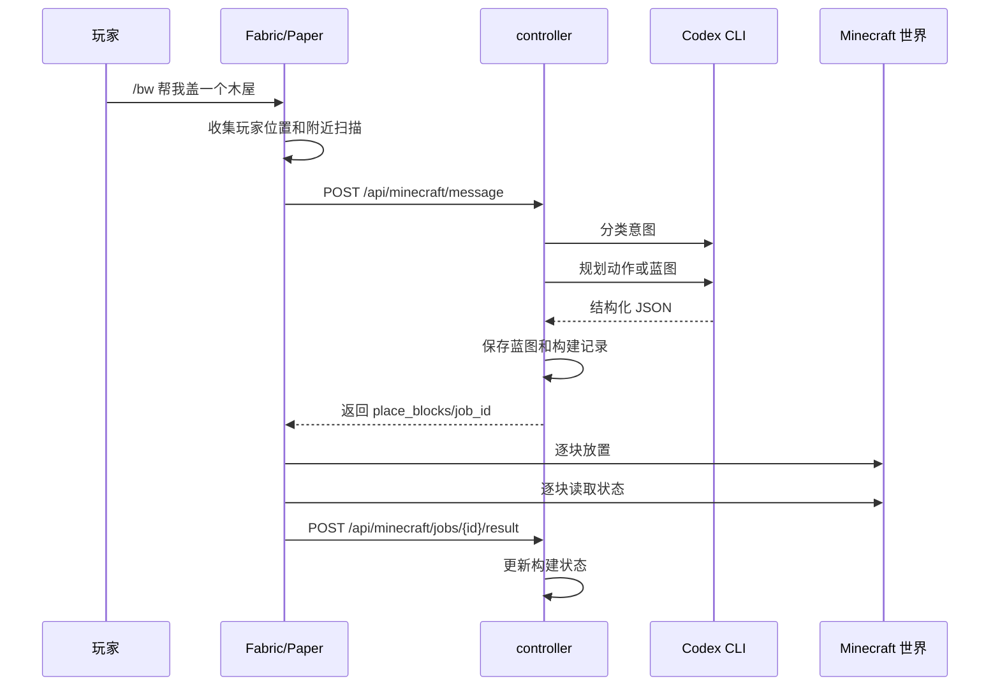
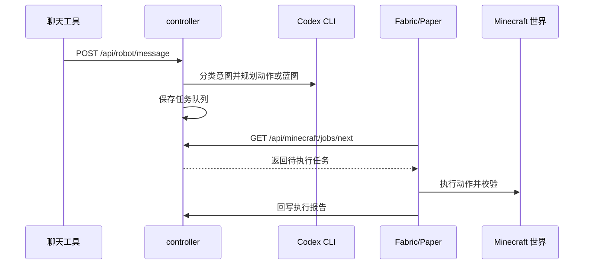

# 架构说明

Blockwright 采用“外部 controller 规划 + Minecraft 执行端落地”的架构。目标是让 AI、聊天工具、蓝图数据和任务调度在普通本地进程里演进，让 Minecraft 插件只负责稳定、可校验的世界操作。

## 设计原则

- Minecraft 插件只做执行：命令入口、玩家上下文、世界扫描、发物品、放方块、回写校验报告。
- 智能规划只在 controller：自然语言理解、Codex CLI、蓝图保存、任务队列、聊天工具接入和构建记录都在 `apps/controller`。
- 蓝图方块坐标始终使用相对坐标；执行时才叠加任务原点。
- 建筑任务必须先保存构建记录，再把同一份方块清单下发给 Minecraft。
- 执行端必须逐块读取世界状态并回写校验报告，只有报告和记录一致才算成功。
- 改造已有建筑必须先扫描附近世界方块，再匹配已保存构建记录；匹配不到、匹配多个或部位不明确时只追问。

## 组件职责

### Rust controller

位置：`apps/controller`

职责：

- 提供 HTTP API。
- 接收 Minecraft 和外部机器人消息。
- 管理蓝图、构建记录、任务队列和 Codex 会话。
- 调用 Codex CLI 先做意图分类，再把输入转换成结构化 `GameAction` 或蓝图。
- 保存蓝图后再生成 `place_blocks` 动作。
- 根据执行端回传的报告更新构建状态。

不负责：

- 不直接修改 Minecraft 世界。
- 不模拟玩家物品栏或鼠标操作。
- 不保存真实聊天工具密钥到仓库。

### Fabric 模组

位置：`plugins/fabric`

职责：

- 支持 HMCL、单人存档和局域网开放世界。
- 注册 `/bw` 命令。
- 收集玩家、世界、坐标和附近方块扫描结果。
- 调用 controller 获取动作。
- 用服务端世界方块 API 执行 `give_item`、`place_blocks`、`run_command` 和 `chat`。
- 放置后逐块验证世界状态并回写报告。

Fabric 是当前项目的主安装方式。HMCL 单人存档和局域网开放世界不需要迁移到 Paper 服务端。

### Paper 插件

位置：`plugins/paper`

职责：

- 支持独立 Paper 服务端。
- 注册 `/bw` 命令。
- 轮询或调用 controller 获取任务。
- 执行游戏动作并回写结果。

Paper 只用于真正运行独立服务端的场景，不作为 HMCL 本地世界的默认方案。

### 聊天工具

聊天工具通过 controller 接入，推荐模式：

- `local_command`
- `polling`
- `stream`

本地 Minecraft 场景不要使用 webhook-only 入口，因为它通常要求公网回调地址，不适合本地房主机器和局域网世界。

## 请求流程

### 游戏内命令



### 外部机器人任务



## 核心数据模型

### Blueprint

蓝图是建筑的持久化表示：

```text
Blueprint
  id
  name
  description
  size
  materials[]
  blocks[]
  tags[]
```

`blocks[]` 使用相对坐标，例如：

```json
{
  "x": 0,
  "y": 0,
  "z": 0,
  "material": "minecraft:oak_planks"
}
```

`material` 可以包含 Minecraft 方块状态：

```text
minecraft:oak_leaves[persistent=true]
minecraft:oak_door[half=lower,facing=south]
minecraft:red_bed[part=head,facing=north]
```

方块状态是保存、下发、执行和校验的一致性约束，不能只比较方块 ID。

### GameAction

controller 对 Minecraft 执行端返回结构化动作：

```text
give_item
place_blocks
run_command
chat
```

执行端根据动作类型操作服务端世界 API。`run_command` 必须经过命令白名单，不能执行高风险命令。

### BuildRecord

构建记录保存一次实际下发的建筑任务：

```text
BuildRecord
  job_id
  blueprint_id
  origin
  expected_actions
  status
  result
```

执行端回传的 `verified_count`、`mismatch_count` 和 `mismatches` 决定构建是否成功。

## 建筑规划约束

住宅、木屋、房间、树屋默认按可玩建筑处理，至少需要考虑：

- 地板、墙、屋顶。
- 入口和可达路径。
- 两格高室内空间。
- 床、照明和窗户。
- 门的上下两块状态匹配。
- 床的 head/foot 两块状态匹配。
- 树叶优先使用 `persistent=true`。

水、岩浆、火、沙子、沙砾、红石、门、床等有特殊物理或状态的方块，必须明确状态或改用更稳定材料。

## 运行时数据

默认运行时目录：

```text
data/
  blueprints/
  builds/
  codex_home/
  codex_sessions.json
```

这些数据不会提交到 Git。

`data/codex_home/` 是隔离的 Codex home。controller 启动时会把 `apps/controller/codex-home-template/skills/` 里的 Blockwright skills 同步进去，并复用本机 Codex 登录态软链接。这样 Blockwright 执行时不会读取用户全局其他项目的自定义 skills。

## 配置与安全

服务器配置位于 `config/servers/*.yaml`，通过 `SERVER_NAME` 选择。聊天工具真实配置位于未追踪文件 `config/chat.local.yaml`。

公网或跨机器使用时必须注意：

- 启用 `security.require_token`。
- 使用强随机 `shared_token`。
- 不提交 `.env`、`config/chat.local.yaml` 或任何真实凭证。
- controller 只暴露在可信网络或本地反向代理后。
