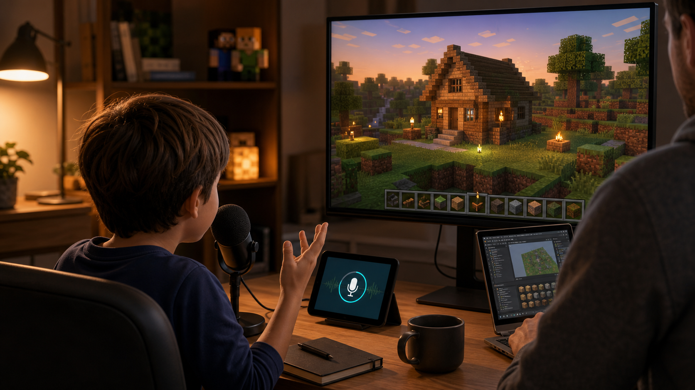
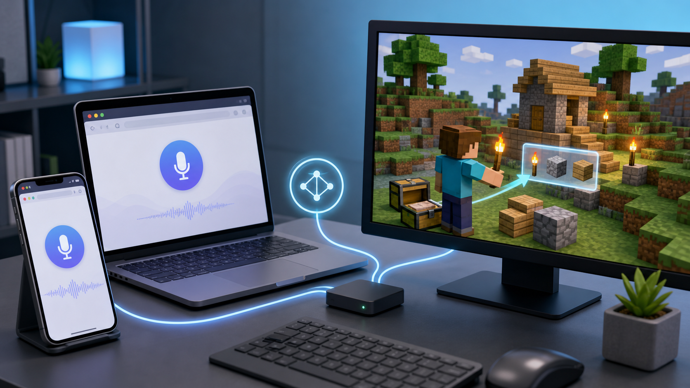
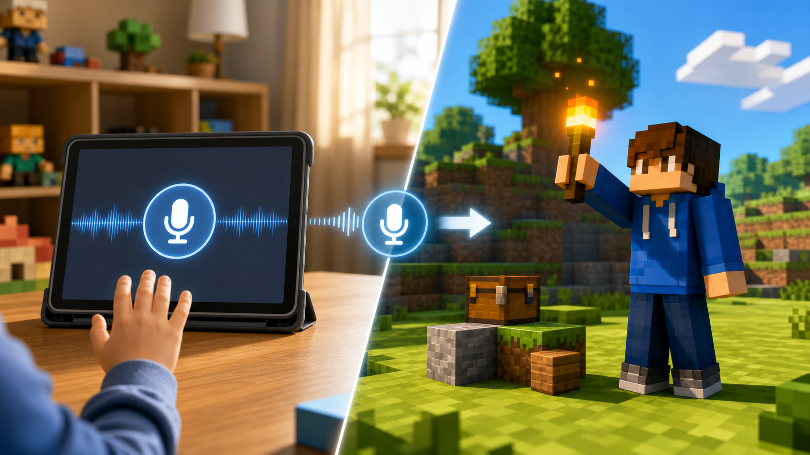
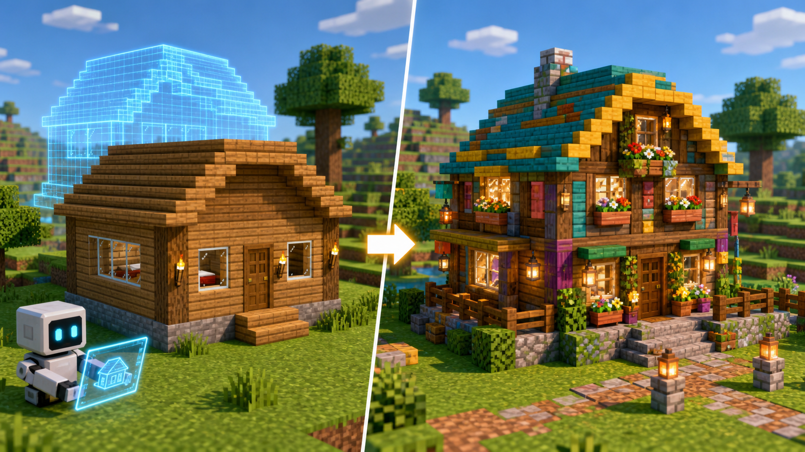

# I Built a Minecraft AI Mod for My 5-Year-Old Daughter, So She Could Play by Talking Instead of Reading Menus



I have been building a Minecraft Java Edition mod called **Blockwright**.

The origin is very simple. It did not start as a big plan to “AI-enable” a game. It started with my 5-year-old daughter.

She loves playing Minecraft. She knows what she wants to say. She knows the names of many items. She can ask for a torch, a bed, glass, a door, or a small house. She can say that she wants it to be daytime, or that she wants to change something in front of her.

But she cannot read much yet.

For adults, Minecraft menus, item names, commands, and settings are just things we search for, type, or look up. For a young child, that is a very different barrier. She may know that she wants a torch, but she cannot easily find the word in the inventory. She may want to build a house, but she does not know where to start. She may want to modify a place in the world, but she cannot translate that into game operations.

So I started asking myself: if she can already say what she wants, can Minecraft listen?

That became the first idea behind Blockwright: **turn natural language and voice into real actions inside Minecraft.**

## It Is Not Just a Chatbot

After installing Blockwright, a player can send requests in several ways:

- Type `/bw ...` inside Minecraft chat
- Open a local or LAN web page and type
- Hold a microphone button on the web page and speak
- Connect chat tools such as Element/Matrix, DingTalk, or local scripts

For example, a player can say:

```text
Give me a stack of torches
Make it daytime
Stop the rain
Build me a small wooden house with windows, a bed, and lights
Replace the wall in front of me with stone bricks
```

For a child, the important part is not that “AI is impressive.” The important part is that she no longer needs to read every item name, remember every command, or understand every menu before she can express what she wants to do.

She can say, “Give me torches,” get the torches, and then place them herself. Or she can ask for a simple house, use it as a starting point, then keep modifying it by hand: break a few blocks, add decorations, change materials, and make it her own.

That matters to me. I do not want AI to replace her play. I want it to help with the parts that block her from playing.



## The Use Cases I Care About Most

The first use case is **finding and giving items**.

Young players often know what they want, but they cannot easily search through the creative inventory. Blockwright can turn a request like “give me a diamond sword,” “give me some glass,” or “give me a bed” into an actual item action, and it tries to make the item visible in the player's main hand.

The second use case is **common world operations**.

Changing the time, clearing the weather, giving night vision, changing game mode, teleporting, adding effects, or running other command-style operations are all possible in Minecraft, but most players should not have to memorize command syntax just to do simple things. Natural language is often a better interface.

The third use case is **getting started with building**.

Many players do want to build. The hard part is often the first step. Blockwright can create a playable starting structure: floor, walls, roof, entrance, two-block-high interior space, bed, lighting, windows, and a path you can actually use. Then the player can continue building from there.

The fourth use case is **iterative editing**.

For example, you can first say:

```text
Build me a small wooden cabin
```

Then continue with:

```text
Make the roof taller
Add more windows
Put a bed and some lights inside
Replace this wall with stone bricks
```

That feels much closer to the real way people build in Minecraft: make a rough version, look at it, then keep adjusting.



## Why I Made It a Local/LAN Web Interface

My own setup is a local Minecraft world plus a web page available on my local network.

Inside Minecraft, the player can type:

```text
/bw web
```

Then Blockwright shows the web address. On the same machine, it is usually:

```text
http://127.0.0.1:8765/web
```

On a local network, another phone, tablet, or computer can open the same web interface. This means a child can keep Minecraft open and use another device to press the microphone button and speak.

For a family setup, this is very practical. The Minecraft world stays where it is. You do not need to move the map to a dedicated Paper server. A child does not need to understand command lines, API keys, or backend services.

The main installation path for Blockwright is a **Fabric mod** for Minecraft Java Edition 1.21.x, including single-player saves and LAN-opened worlds. Paper support exists too, but it is mainly for standalone server setups.

## What Happens Behind the Scenes

Blockwright has two main parts:

- The Minecraft-side Fabric mod reads player state, scans nearby blocks, gives items, places blocks, runs commands, and reports results.
- The local controller handles the web page, model configuration, task queues, blueprints, build records, MCP tools, and AI planning.

I did not want this to become a black box where AI just runs random commands. For building tasks, Blockwright saves a blueprint and a build record first, then sends the same block list to the Minecraft execution side. After placement, the mod reads the world back block by block and returns a verification report.

In short: **natural language comes in, controlled actions go out, and the result can be checked.**

That is important because Minecraft is not an image. Success is not whether the assistant wrote a nice response. Success is whether the blocks were actually placed, the item actually reached the player's hand, and the command actually changed the world.



## What Blockwright Supports Today

Current input options include:

- Minecraft `/bw` command
- Local web text chat
- Web voice input
- Element/Matrix
- DingTalk robot
- Local commands or custom scripts

Current capabilities include:

- Reading player state: main hand, off hand, hotbar, and inventory
- Scanning nearby world blocks
- Giving items and trying to make them visible in the player's main hand
- Running command-style operations such as time, weather, effects, and game mode changes
- Placing buildings through blueprints
- Editing based on existing build records
- Saving blueprints and build records
- Writing back verification reports after execution

Supported model backends include:

- Codex CLI
- OpenAI
- DeepSeek
- Doubao
- Gemini

## It Is Not a “Universal Minecraft AI”

I do not want to oversell it.

Blockwright is currently best suited for:

- Children or new players who want to use voice or natural language for common operations
- Creative-mode players who want to quickly get materials, adjust the environment, or start a build
- Local single-player worlds and LAN-opened worlds
- Players or server operators who want to connect Minecraft to web, voice, or chat tools
- Developers interested in a Minecraft AI execution loop with records and verification

There is still a lot to improve: more advanced building edits, undo/rollback, image-to-blueprint workflows, clearer failure reports, and more.

But for my daughter, the original problem is already partly solved. She does not need to read every word or memorize every command before she can express what she wants.

That is the part I care about most.

## Project Link

Blockwright is open source:

GitHub: <https://github.com/mari0w/blockwright>

If you play Minecraft Java Edition, or if you have a young player at home who can say what they want but cannot yet read everything on the screen, this may be an interesting direction to try.

To me, Blockwright is not about letting AI play the game for a child. It is about giving the child a Minecraft helper that can hand her the right item, build the first wall, light up the room, and then leave the creative part to her.
